```mermaid
flowchart LR
    subgraph polling["❌ Polling Approach (Legacy)"]
        direction TB
        p1["Every 60 seconds:"]
        p2["Query database"]
        p3["Check for due posts"]
        p4["Wait 60s"]
        p1 --> p2 --> p3 --> p4 -.-> p1
        stats1["📊 1,440 queries/day<br/>0-60s delay<br/>High CPU overhead"]
    end

    subgraph eventdriven["✅ Event-Driven (Zero-Polling)"]
        direction TB
        e1["User schedules post"]
        e2["Create BullMQ<br/>delayed job"]
        e3["Execute EXACTLY<br/>when needed"]
        e4["Redis persists state"]
        e1 --> e2 --> e3
        e2 -.-> e4
        stats2["📊 10-50 queries/day<br/>0-5s delay<br/>Minimal overhead"]
    end

    polling --> eventdriven

    style polling fill:#ffeeee,stroke:#cc0000,stroke-width:2px
    style eventdriven fill:#eeffee,stroke:#00cc00,stroke-width:2px
    style stats1 fill:#fff0f0,stroke:#cc6666
    style stats2 fill:#f0fff0,stroke:#66cc66
```

# Technical Architecture & Implementation Guide

**Complete reference for developers working with the Threads Auto-Post system.**

---

## Table of Contents

1. [System Overview](#system-overview)
2. [Architecture & Design](#architecture--design)
3. [Event-Driven Scheduling](#event-driven-scheduling)
4. [Key Components](#key-components)
5. [Setup & Configuration](#setup--configuration)
6. [Development & Testing](#development--testing)
7. [Deployment](#deployment)
8. [Troubleshooting](#troubleshooting)
9. [Refactoring Roadmap](#refactoring-roadmap)

---

## System Overview

### What is Threads Auto-Post?

A production-grade, event-driven post scheduling system for Meta Threads featuring:

- **Zero-polling scheduler** - Event-driven BullMQ jobs reduce database queries by 95%
- **Multi-account support** - OAuth 2.0 credential management
- **Excel bulk import** - Batch post creation with duplicate detection
- **Recurring schedules** - ONCE, WEEKLY, MONTHLY, DATE_RANGE patterns
- **Production-ready** - Idempotency, retries, graceful shutdown, job monitoring

### Technology Stack

| Layer          | Technology                          |
| -------------- | ----------------------------------- |
| Frontend       | React 19, TypeScript, Vite, Shadcn UI, Tailwind CSS |
| Backend        | Node.js 20+, Express, TypeScript    |
| Database       | MongoDB (Mongoose ODM)              |
| Job Queue      | Redis + BullMQ                      |
| Infrastructure | Docker, Docker Compose, PM2         |
| Monorepo       | Turbo                               |

### Architecture Diagram


**Process Separation**:
- **API Server** (`index.ts` on port 3001) - HTTP endpoints, does NOT publish posts
- **Worker Process** (`worker.ts`) - Consumes jobs, publishes to Threads API, separate process

---

## Architecture & Design

### Post Publishing Flow


### Job Queue States

```mermaid
graph TD
    Draft["📝 DRAFT<br/>User editing"] -->|Schedule| Scheduled["⏰ SCHEDULED<br/>In database"]
    Scheduled -->|Due time| Publishing["🔄 PUBLISHING<br/>Job in queue"]
    Publishing -->|Success| Published["✅ PUBLISHED<br/>On Threads"]
    Publishing -->|Failure| Failed["❌ FAILED<br/>Ready for retry"]
    Failed -->|Retry| Publishing
    Draft -->|Delete| Deleted["🗑️ DELETED"]
    Scheduled -->|Delete| Deleted
```



---

## Event-Driven Scheduling

### Polling vs Event-Driven Comparison



### How Event-Driven Works


### Key Concepts

#### 1. Batch Window (5 seconds)

Posts due within 5 seconds are processed together:


**Configuration**: `SCHEDULER_BATCH_WINDOW_MS=5000` (default 5 seconds)

#### 2. Redis State Persistence

```mermaid
flowchart TD
    subgraph redis["Redis State Persistence<br/>(Survives Server Restarts)"]
        direction LR
        k1["🔑 scheduler:nextExecutionAt<br/>1735312200000<br/>(Timestamp of next check)"]
        k2["🔑 scheduler:activeJobId<br/>scheduler-check-1735312200000<br/>(Current delayed job)"]
        k3["🔑 scheduler:lastCheck<br/>1735312150000<br/>(Previous check time)"]
    end

    startup["🚀 Server Restart"]

    startup --> redis
    redis --> init["Initialize():<br/>Load Redis keys"]
    init --> restore["Restore scheduler state<br/>Recreate delayed job if missing"]
    restore --> resume["Resume scheduling<br/>No posts lost"]

    style redis fill:#fff3e0,stroke:#f57c00,stroke-width:2px
    style restore fill:#c8e6c9,stroke:#388e3c,stroke-width:2px
    style resume fill:#e1f5fe,stroke:#0288d1,stroke-width:2px
```



**Recovery**: On startup, `initialize()` loads state from Redis and recreates jobs if missing.

#### 3. Idempotent Job Creation

```typescript
// Same scheduledAt = Same job ID = No duplicates
const jobId = `scheduler-check-${checkTimestamp}`;

// BullMQ automatically deduplicates by jobId
await schedulerQueue.add("check-due-posts", data, { jobId });
```

### Scheduler State Machine

```mermaid
graph TD
    Init["🚀 Initialize<br/>Restore from Redis"] --> CheckState{"Job exists<br/>in BullMQ?"}
    CheckState -->|Yes & Delayed| Active["✅ Active<br/>Waiting..."]
    CheckState -->|No/Wrong| Restore["🔄 Restore<br/>Query earliest post"]
    Restore --> CreateJob["📋 Create new job<br/>Schedule for that time"]
    CreateJob --> Active

    Active --> Due{"Time arrived?"}
    Due -->|Yes| Process["⚙️ processDuePosts()<br/>Query & queue posts"]
    Due -->|No| Active

    Process --> FindNext["🔍 Find next post"]
    FindNext --> HasNext{"Posts<br/>exist?"}
    HasNext -->|Yes| CreateNext["📋 Create next job"]
    CreateNext --> Active
    HasNext -->|No| Clear["🧹 Clear state"]
    Clear --> Idle["⏸️ Idle<br/>No scheduled posts"]

    Idle --> NewPost["📌 New post scheduled"]
    NewPost --> Active
```



### Performance Comparison

| Metric               | Polling  | Event-Driven |
| -------------------- | -------- | ------------ |
| DB Queries/hour      | 60       | 1-10         |
| Scheduling Latency   | 0-60s    | 0-5s         |
| CPU Usage            | Constant | 0% when idle |
| Memory               | Low      | Lower        |
| Scales to 10k+ posts | ❌ No    | ✅ Yes       |

### Migration from Polling to Event-Driven

**Phase 1: Enable (can run both)**
```bash
USE_EVENT_DRIVEN_SCHEDULER=true
```

**Phase 2: Monitor** - Check logs for discrepancies

**Phase 3: Full switch** - Remove `SchedulerService.start()` call

**Rollback**: Set `USE_EVENT_DRIVEN_SCHEDULER=false` to revert instantly

---

## Key Components

### PostService

**File**: `apps/backend/src/services/PostService.ts`

**Responsibilities**:
- CRUD operations on posts
- Post validation
- Schedule management
- Emit scheduler events

**Key Methods**:

```typescript
async createPost(data): Promise<IPost>
async updatePost(id, data): Promise<IPost>
async deletePost(id): Promise<void>
async schedulePost(postId, config): Promise<IPost>
async getPosts(filters): Promise<{ posts, total }>
```

**Event Emissions**:

```typescript
// When post is scheduled
await eventDrivenScheduler.onPostScheduled(postId, scheduledAt);

// When post is deleted
await eventDrivenScheduler.onPostCancelled(postId);
```

### EventDrivenScheduler

**File**: `apps/backend/src/services/EventDrivenScheduler.ts`

**Responsibilities**:
- Zero-poll scheduling
- Redis state management
- Event handling
- Job processing

**Key Methods**:

```typescript
async initialize(): Promise<void>
async onPostScheduled(postId, scheduledAt): Promise<void>
async onPostCancelled(postId): Promise<void>
async processDuePosts(): Promise<void>
async scheduleNextCheck(): Promise<void>
```

**Processing Pipeline**:

```
processDuePosts()
  ├─ Query due posts (scheduledAt <= now + BATCH_WINDOW_MS)
  ├─ For each post:
  │   ├─ Check if one-time or recurring
  │   ├─ Generate job ID (idempotent)
  │   ├─ Add to postQueue
  │   └─ Update status → PUBLISHING
  ├─ Find next earliest post
  └─ Schedule new delayed job
```

### BullMQ Queues

**Two Separate Queues**:

#### 1. `post-publishing` Queue

- **Purpose**: Publish posts to Threads API
- **Jobs**: `publish-post` with `{ postId, accountId?, commentOnlyRetry? }`
- **Concurrency**: 5 (configurable via `WORKER_CONCURRENCY`)
- **Retries**: 3 with exponential backoff
- **Worker**: `worker.ts` processor
- **Rate Limit**: 10 requests/minute

#### 2. `scheduler-meta` Queue

- **Purpose**: Scheduler meta-jobs
- **Jobs**: `check-due-posts` with `{ checkTime }`
- **Concurrency**: 1 (only one check at a time)
- **Retries**: 3
- **Worker**: `worker.ts` scheduler worker

### ThreadsAdapter

**File**: `apps/backend/src/adapters/ThreadsAdapter.ts`

**Responsibilities**:
- Threads API integration
- Media upload & validation
- Post publishing
- Comment posting

**Methods**:

```typescript
async publishPost(post): Promise<{ success, platformPostId, commentResult }>
async publishComment(threadsPostId, comment): Promise<{ success, commentId }>
async createTextContainer(content): Promise<{ containerId }>
async createImageContainer(url, content): Promise<{ containerId }>
async createCarouselContainer(urls, content): Promise<{ containerId }>
async createVideoContainer(url, content): Promise<{ containerId }>
async publishContainer(containerId): Promise<{ postId }>
```

### MonitoringService

**File**: `apps/backend/src/services/MonitoringService.ts`

**Responsibilities**:
- Queue health monitoring
- Job statistics
- Scheduled post visibility

**Key Methods**:

```typescript
async getQueueHealth(): Promise<HealthData>
async getQueueStats(): Promise<StatsData>
async getRecentJobs(limit): Promise<RecentJobsData>
async getScheduledPosts(): Promise<JobRecord[]>
```

### IdempotencyService

**File**: `apps/backend/src/services/IdempotencyService.ts`

**Responsibilities**:
- Duplicate detection (content hash within 24h window)
- Execution lock management (5-minute timeout)
- Comment retry logic

**Key Methods**:

```typescript
async checkForDuplicate(content, images, video, postId): Promise<{ isDuplicate, message }>
async acquireExecutionLock(postId, workerId): Promise<{ acquired, reason }>
async releaseExecutionLock(postId): Promise<void>
async canPublish(postId): Promise<{ canPublish, reason }>
```

---

## Setup & Configuration

### Prerequisites

- **Docker Desktop** (includes Docker & Docker Compose) OR **Node.js 20+**
- **Git**
- **Meta Threads API credentials** from [Meta Developers](https://developers.facebook.com/)

### System Requirements

**Ports Required**:
- **80** or **3000** (Frontend)
- **3001** (Backend API)
- **27017** (MongoDB)
- **6379** (Redis)

**Verify Installation**:
```bash
docker --version          # Docker 24.0+
docker-compose --version  # Docker Compose 2.0+
# OR
node --version           # Node 20+
npm --version            # npm 9+
```

### Environment Configuration

#### Backend Environment (`apps/backend/.env`)

```bash
# Server
PORT=3001
NODE_ENV=development
CORS_ORIGIN=http://localhost:5173

# Database
MONGODB_URI=mongodb://localhost:27017/threads-post-scheduler

# Redis
REDIS_HOST=localhost
REDIS_PORT=6379
REDIS_PASSWORD=

# Timezone (⚠️ DO NOT CHANGE without updating all date handling)
TZ=Asia/Ho_Chi_Minh

# Scheduling
USE_EVENT_DRIVEN_SCHEDULER=true
SCHEDULER_BATCH_WINDOW_MS=5000

# Rate Limiting
WORKER_CONCURRENCY=5
JOB_TIMEOUT=300000

# Threads OAuth
THREADS_CLIENT_ID=your_meta_app_id
THREADS_CLIENT_SECRET=your_meta_app_secret
THREADS_REDIRECT_URI=http://localhost:3001/api/credentials/callback

# Optional: Default credentials (if not using multi-account OAuth)
THREADS_USER_ID=your_threads_user_id
THREADS_ACCESS_TOKEN=your_access_token
THREADS_REFRESH_TOKEN=your_refresh_token
```

#### Frontend Environment (`apps/frontend/.env`)

```bash
VITE_API_URL=http://localhost:3001
```

### Threads OAuth Setup

1. **Create Meta App** at [Meta Developers](https://developers.facebook.com/)
2. **Configure App**:
   - Add product: "Threads API"
   - Permissions: `threads_basic`, `threads_content_publish`
   - Redirect URI: `http://localhost:3001/api/credentials/callback`
3. **Get Credentials**:
   - Copy **App ID** → `THREADS_CLIENT_ID`
   - Copy **App Secret** → `THREADS_CLIENT_SECRET`
4. **Link Account** in app UI:
   - Navigate to Settings → Accounts
   - Click "Link Threads Account"
   - Complete OAuth flow

### Installation

#### Option 1: Docker (Recommended)

```bash
# Clone repository
git clone <your-repo-url>
cd threads-auto-post

# Start all services
docker-compose up --build

# Access
# Frontend: http://localhost:3000
# Backend:  http://localhost:3001/health
```

#### Option 2: Local Development

```bash
# Install dependencies
npm install

# Start MongoDB & Redis
docker-compose up mongodb redis -d

# Terminal 1: Start API server
npm run dev:backend

# Terminal 2: Start worker process
npm run dev:worker

# Terminal 3: Start frontend
npm run dev:frontend

# Access
# Frontend: http://localhost:5173
# Backend:  http://localhost:3001/health
```

### Project Structure

```
threads-auto-post/
├── apps/
│   ├── backend/                    # Node.js + Express API & Worker
│   │   ├── src/
│   │   │   ├── adapters/           # Platform adapters (Threads)
│   │   │   ├── config/             # Database, Redis, logging
│   │   │   ├── models/             # MongoDB schemas
│   │   │   ├── queue/              # BullMQ setup
│   │   │   ├── routes/             # API endpoints
│   │   │   ├── services/           # Business logic
│   │   │   ├── index.ts            # API server
│   │   │   └── worker.ts           # Worker process
│   │   ├── tests/                  # Integration tests
│   │   └── scripts/                # Utility scripts
│   │
│   └── frontend/                   # React + Vite frontend
│       ├── src/
│       │   ├── components/         # UI components
│       │   ├── hooks/              # Custom React hooks
│       │   ├── lib/                # API client
│       │   ├── context/            # React context providers
│       │   ├── App.tsx
│       │   └── main.tsx
│       └── package.json
│
├── docker-compose.yml              # Docker orchestration
├── ARCHITECTURE.md                 # This file
├── BUSINESS_FEATURES.md            # Feature documentation
├── README.md                       # User guide
└── package.json                    # Monorepo root
```

---

## Development & Testing

### Development Workflow

```bash
# Start backend in watch mode
npm run dev:backend

# Start worker in watch mode
npm run dev:worker

# Start frontend in watch mode
npm run dev:frontend

# View logs
docker-compose logs -f backend
docker-compose logs -f mongodb
docker-compose logs -f redis
```

### Testing

#### Integration Tests

```bash
# Install test dependencies
npm install --save-dev vitest @vitest/ui

# Run all tests
npm run test

# Run integration tests only
npm run test:integration

# Watch mode
npm run test:watch

# With UI
npm run test:ui
```

**Test Files**:
- `tests/integration/setup.ts` - Test utilities
- `tests/integration/PostService.test.ts` - Post CRUD & scheduling
- `tests/integration/EventDrivenScheduler.test.ts` - Scheduler logic

**Coverage**:
- ✅ Post creation, update, delete
- ✅ Scheduling with all patterns
- ✅ Scheduler initialization & restart
- ✅ Event-driven reschedule logic
- ✅ Batch processing
- ✅ Idempotency

#### Manual Testing

```bash
# 1. Create a post
curl -X POST http://localhost:3001/api/posts \
  -H "Content-Type: application/json" \
  -d '{"content": "Test post", "postType": "TEXT"}'

# 2. Schedule it
curl -X POST http://localhost:3001/api/posts/{postId}/schedule \
  -H "Content-Type: application/json" \
  -d '{
    "scheduledAt": "2025-12-27T14:30:00Z",
    "pattern": "ONCE"
  }'

# 3. Check scheduler state
redis-cli GET scheduler:nextExecutionAt
redis-cli GET scheduler:activeJobId

# 4. Monitor
curl http://localhost:3001/api/monitoring/queue

# 5. View logs
npm run worker
# Should show: "⏰ Next check scheduled in 3600s at..."
```

---

## Deployment

### Docker Production Build

```bash
# Build images
docker-compose -f docker-compose.prod.yml build

# Start services
docker-compose -f docker-compose.prod.yml up -d

# View logs
docker-compose -f docker-compose.prod.yml logs -f
```

### PM2 Process Manager

```bash
# Install PM2
npm install -g pm2

# Start with ecosystem file
pm2 start ecosystem.config.cjs

# Monitor
pm2 monit

# Logs
pm2 logs

# Restart
pm2 restart all
```

### Environment Variables for Production

```bash
# .env.production
NODE_ENV=production
CORS_ORIGIN=https://your-domain.com
MONGODB_URI=mongodb://production-host:27017/threads-post-scheduler
REDIS_HOST=production-redis-host
THREADS_REDIRECT_URI=https://your-domain.com/api/credentials/callback
```

---

## Troubleshooting

### Problem: Scheduler not running

**Check 1: Redis state**
```bash
redis-cli GET scheduler:nextExecutionAt
redis-cli GET scheduler:activeJobId
```

**Check 2: BullMQ jobs**
```bash
curl http://localhost:3001/api/monitoring/queue/scheduler-meta
```

**Fix**: Force immediate check
```typescript
await eventDrivenScheduler.scheduleImmediateCheck();
```

### Problem: Post not published at scheduled time

**Check 1: Post exists & is SCHEDULED**
```bash
# MongoDB
db.posts.findOne({ status: "SCHEDULED" })
```

**Check 2: Worker running**
```bash
npm run worker
# Should show active jobs
```

**Check 3: BullMQ queue has job**
```bash
curl http://localhost:3001/api/monitoring/queue/post-publishing
```

### Problem: MongoDB connection failed

```bash
# Check if MongoDB is running
docker-compose ps mongodb

# View logs
docker-compose logs mongodb

# Restart MongoDB
docker-compose restart mongodb
```

### Problem: Redis connection failed

```bash
# Test Redis
redis-cli ping
# Output: PONG

# Check config
echo $REDIS_HOST
echo $REDIS_PORT

# Restart Redis
docker-compose restart redis
```

### Problem: Worker not processing jobs

```bash
# Ensure worker process is running
npm run dev:worker

# Check logs
docker-compose logs backend | grep -i worker

# Verify Redis connection
docker exec -it threads-redis redis-cli ping
# Expected: PONG
```

### Problem: OAuth callback fails

- Ensure `THREADS_REDIRECT_URI` matches Meta app settings exactly
- Check `THREADS_CLIENT_ID` and `THREADS_CLIENT_SECRET` are correct
- Verify redirect URI is whitelisted in Meta app

### Problem: Posts stuck in PUBLISHING

```bash
# Run cleanup script
cd apps/backend
npm run cleanup-stuck-posts

# Or use API endpoint
curl -X POST http://localhost:3001/api/posts/{postId}/fix-stuck
```

### Problem: Scheduled posts not publishing

- Verify post status is `SCHEDULED` (not `DRAFT`)
- Check scheduled time is in future (uses `Asia/Ho_Chi_Minh` timezone)
- Ensure worker process is running
- Review scheduler logs: `docker-compose logs backend | grep -i scheduler`

---

## Edge Cases & Handling

### 1. Post Scheduled Before Current Next Execution

**Scenario**: Current job scheduled for 15:00, new post for 14:30

**Handling**:
```
onPostScheduled(post2Id, 14:30)
  ├─ Check Redis: nextExecutionAt = 15:00
  ├─ Compare: 14:30 < 15:00 → Earlier!
  ├─ Remove job scheduled for 15:00
  ├─ Create new job for 14:30
  └─ Update Redis
```

**Result**: ✅ Earlier post published first

### 2. All Scheduled Posts Deleted

**Scenario**: User deletes only scheduled post

**Handling**:
```
onPostCancelled(postId)
  ├─ Query: Any SCHEDULED posts?
  ├─ Result: None
  ├─ Clear Redis state
  └─ No new job created
```

**Result**: ✅ System idle, no wasted job

### 3. Server Crash During Execution

**Scenario**: Worker dies while processing posts

**Handling on Restart**:
```
initialize()
  ├─ Load nextExecutionAt from Redis
  ├─ Check BullMQ job exists
  ├─ If missing: Query earliest post, recreate job
  └─ Resume scheduling
```

**Result**: ✅ No posts lost, automatic recovery

### 4. Recurring Post Rescheduling

**Scenario**: Weekly post publishes, next occurrence next week

**Handling**:
```
processDuePosts() [for weekly post]
  ├─ Publish to Threads
  ├─ Calculate next occurrence (next Monday)
  ├─ Update scheduledAt in MongoDB
  ├─ scheduleNextCheck() finds it
  └─ Creates job for next week
```

**Result**: ✅ Recurring posts self-manage

### 5. Race Condition: Multiple Scheduler Jobs

**Scenario**: Two workers both create scheduler jobs

**Handling**:
```
Job ID = `scheduler-check-{timestamp}`

Worker 1: Add job-1735312200000
BullMQ: ✅ Accepted

Worker 2: Add job-1735312200000
BullMQ: Already exists, skip ✅
```

**Result**: ✅ Idempotent, no duplicates

---

## Refactoring Roadmap

### Current Technical Debt

1. **Worker Decomposition** - `worker.ts` is ~1000 lines mixed logic
2. **Post Service Cleanup** - Status transitions scattered across files
3. **Error Handling** - Error classification embedded in worker
4. **Frontend Components** - Some components too large (PostRow, PostsList)

### Planned Improvements

#### 1. Backend Refactoring

**A. Worker Decomposition**
- Create `PublishingJobProcessor.ts` - Move job processing logic
- Create `ErrorClassificationService.ts` - Move error classification
- Create `PostRecoveryService.ts` - Move stalled job recovery
- Create `NotificationService.ts` - Future: alerting on failures

**B. Post Service Cleanup**
- Move status transition logic to `Post.ts` methods or `PostService.ts`
- Standardize `publishingProgress` updates with helper `updatePostProgress(post, step, status)`

**C. Unified Scheduler Logic**
- Deprecate `SchedulerService` (polling) once event-driven is stable
- Move scheduling calculations to `SchedulingDomain.ts` for reusability

#### 2. Frontend Refactoring

**A. Component Decomposition**
- Extract `PostStatusBadge` from `PostRow.tsx`
- Extract `PostProgressIndicator` from `PostRow.tsx`
- Move API calls from components to custom hooks

**B. Constants and Types**
- Centralize type definitions in dedicated `types` folder
- Share interfaces across frontend/backend

### Immediate Action Plan

1. **Extract Error Classification** - Low-hanging fruit, move to `src/services/ErrorService.ts`
2. **Standardize Logging** - Consistent logger usage with metadata
3. **Clean up Dead Code** - Remove commented-out code in `worker.ts`

### Status Check

- **Chaos Level**: High in `worker.ts`, Moderate in `PostRow.tsx`
- **Risk**: High (Worker handles critical publishing logic)
- **Strategy**: Incremental refactoring, extract pure functions first

---

## API Reference

### Posts Endpoints

- `GET /api/posts` - List posts (filtering, pagination)
- `GET /api/posts/:id` - Get single post
- `POST /api/posts` - Create post
- `PUT /api/posts/:id` - Update post
- `DELETE /api/posts/:id` - Delete post
- `POST /api/posts/:id/schedule` - Schedule post
- `POST /api/posts/:id/publish` - Publish immediately
- `POST /api/posts/:id/cancel` - Cancel scheduled post
- `POST /api/posts/:id/retry` - Retry failed post
- `POST /api/posts/:id/fix-stuck` - Fix stuck PUBLISHING post
- `GET /api/posts/:id/progress` - Get publishing progress

### Bulk Operations

- `POST /api/posts/bulk-delete` - Delete multiple posts
- `POST /api/posts/bulk-schedule` - Schedule multiple posts
- `POST /api/posts/bulk-cancel` - Cancel multiple schedules
- `POST /api/posts/bulk-update-status` - Update status for multiple posts

### Excel Operations

- `POST /api/excel/import` - Import posts from Excel
- `POST /api/excel/check-duplicates` - Check for duplicates before import

### Monitoring

- `GET /api/monitoring/queue` - Queue health statistics
- `GET /api/monitoring/jobs` - Recent job history
- `GET /api/monitoring/queue/:queueName` - Specific queue stats

### Credentials (Multi-Account)

- `GET /api/credentials` - List linked Threads accounts
- `POST /api/credentials/setup` - Add account manually
- `GET /api/credentials/auth` - Start OAuth flow
- `GET /api/credentials/callback` - OAuth callback
- `DELETE /api/credentials/:id` - Unlink account
- `PATCH /api/credentials/:id/default` - Set default account

---

## Production Features

### Idempotency & Deduplication

- **Content Hash**: SHA-256 hash of content + media prevents duplicate publishing
- **Execution Lock**: Redis-based lock prevents concurrent publishing of same post
- **24-Hour Window**: Detects duplicates within configurable time window

### Error Handling & Retries

- **Automatic Retry**: 3 attempts with exponential backoff (2s → 4s → 8s)
- **Smart Rollback**: Failed scheduled posts rollback to SCHEDULED for retry
- **Comment Retry**: Comment failures don't fail post (separate retry logic)
- **Error Classification**: FATAL, RETRYABLE, TRANSIENT categories

### Rate Limiting

- **Worker Concurrency**: 5 parallel jobs (configurable)
- **API Rate Limit**: 10 requests/minute to Threads API
- **Respects Quotas**: Adheres to Meta's rate limits

### Resilience

- **Graceful Shutdown**: Completes in-flight jobs before stopping
- **Stalled Job Recovery**: Auto-detects and recovers stuck jobs (5min timeout)
- **Redis Persistence**: Queue state survives worker/server restarts
- **Version Conflict Handling**: Mongoose optimistic concurrency control

---

## Architecture Summary

The system combines:

- **Event-driven scheduling** for zero-polling efficiency
- **BullMQ delayed jobs** for precise execution timing
- **Redis persistence** for state recovery
- **MongoDB** as source of truth
- **Idempotent operations** for crash-safe semantics
- **Batch processing** for efficiency
- **Modular adapters** for multi-platform support

This design scales to millions of scheduled posts while maintaining sub-second accuracy and near-zero idle overhead.

---

**Version**: 2.0  
**Last Updated**: February 2026  
**Status**: Production-Ready
