# Architecture & Implementation Guide

Complete reference for the Threads Auto-Post system architecture, scheduling mechanism, and key components.

## Table of Contents

1. [System Overview](#system-overview)
2. [Event-Driven Scheduling](#event-driven-scheduling)
3. [Architecture Diagrams](#architecture-diagrams)
4. [Key Components](#key-components)
5. [Setup & Configuration](#setup--configuration)
6. [Testing & Validation](#testing--validation)
7. [Troubleshooting](#troubleshooting)

---

## System Overview

### What is Threads Auto-Post?

A production-grade, event-driven post scheduling system for Meta Threads that:

- Schedules posts for future publication
- Supports recurring patterns (ONCE, WEEKLY, MONTHLY, DATE_RANGE)
- Reduces database queries by 95% through event-driven scheduling
- Survives server restarts with Redis persistence
- Handles multiple Threads accounts
- Provides comprehensive monitoring and job tracking

### Architecture Stack


---

## Event-Driven Scheduling

### Core Problem & Solution

```mermaid
flowchart LR
    subgraph polling["❌ Polling Approach (Legacy)"]
        direction TB
        p1["Every 60 seconds:"]
        p2["Query database"]
        p3["Check for due posts"]
        p4["Wait 60s"]
        p1 --> p2 --> p3 --> p4 -.-> p1
        stats1["📊 1,440 queries/day<br/>0-60s delay<br/>High CPU overhead"]
    end

    subgraph eventdriven["✅ Event-Driven (Zero-Polling)"]
        direction TB
        e1["User schedules post"]
        e2["Create BullMQ<br/>delayed job"]
        e3["Execute EXACTLY<br/>when needed"]
        e4["Redis persists state"]
        e1 --> e2 --> e3
        e2 -.-> e4
        stats2["📊 10-50 queries/day<br/>0-5s delay<br/>Minimal overhead"]
    end

    polling --> eventdriven

    style polling fill:#ffeeee,stroke:#cc0000,stroke-width:2px
    style eventdriven fill:#eeffee,stroke:#00cc00,stroke-width:2px
    style stats1 fill:#fff0f0,stroke:#cc6666
    style stats2 fill:#f0fff0,stroke:#66cc66
```



### How It Works


### Key Concepts

#### 1. Batch Window (5 seconds)

Posts due within 5 seconds are processed together:


Configurable: `SCHEDULER_BATCH_WINDOW_MS=5000`

#### 2. Redis State Persistence

```mermaid
flowchart TD
    subgraph redis["Redis State Persistence<br/>(Survives Server Restarts)"]
        direction LR
        k1["🔑 scheduler:nextExecutionAt<br/>1735312200000<br/>(Timestamp of next check)"]
        k2["🔑 scheduler:activeJobId<br/>scheduler-check-1735312200000<br/>(Current delayed job)"]
        k3["🔑 scheduler:lastCheck<br/>1735312150000<br/>(Previous check time)"]
    end

    startup["🚀 Server Restart"]

    startup --> redis
    redis --> init["Initialize():<br/>Load Redis keys"]
    init --> restore["Restore scheduler state<br/>Recreate delayed job if missing"]
    restore --> resume["Resume scheduling<br/>No posts lost"]

    style redis fill:#fff3e0,stroke:#f57c00,stroke-width:2px
    style restore fill:#c8e6c9,stroke:#388e3c,stroke-width:2px
    style resume fill:#e1f5fe,stroke:#0288d1,stroke-width:2px
```



Survives restarts: On startup, `initialize()` restores from Redis.

#### 3. Idempotent Job Creation

```typescript
// Same scheduledAt = Same job ID = No duplicates
const jobId = `scheduler-check-${checkTimestamp}`;

// BullMQ automatically deduplicates
await schedulerQueue.add("check-due-posts", data, { jobId });
```

---

## Architecture Diagrams

### Post Publishing Flow


### Job Queue States

```mermaid
graph TD
    Draft["📝 DRAFT<br/>User editing"] -->|Schedule| Scheduled["⏰ SCHEDULED<br/>In database"]
    Scheduled -->|Due time| Publishing["🔄 PUBLISHING<br/>Job in queue"]
    Publishing -->|Success| Published["✅ PUBLISHED<br/>On Threads"]
    Publishing -->|Failure| Failed["❌ FAILED<br/>Ready for retry"]
    Failed -->|Retry| Publishing
    Draft -->|Delete| Deleted["🗑️ DELETED"]
    Scheduled -->|Delete| Deleted
```



### Scheduler State Machine

```mermaid
graph TD
    Init["🚀 Initialize<br/>Restore from Redis"] --> CheckState{"Job exists<br/>in BullMQ?"}
    CheckState -->|Yes & Delayed| Active["✅ Active<br/>Waiting..."]
    CheckState -->|No/Wrong| Restore["🔄 Restore<br/>Query earliest post"]
    Restore --> CreateJob["📋 Create new job<br/>Schedule for that time"]
    CreateJob --> Active

    Active --> Due{"Time arrived?"}
    Due -->|Yes| Process["⚙️ processDuePosts()<br/>Query & queue posts"]
    Due -->|No| Active

    Process --> FindNext["🔍 Find next post"]
    FindNext --> HasNext{"Posts<br/>exist?"}
    HasNext -->|Yes| CreateNext["📋 Create next job"]
    CreateNext --> Active
    HasNext -->|No| Clear["🧹 Clear state"]
    Clear --> Idle["⏸️ Idle<br/>No scheduled posts"]

    Idle --> NewPost["📌 New post scheduled"]
    NewPost --> Active
```



---

## Key Components

### PostService

**File**: `src/services/PostService.ts`

**Responsibilities**:

- CRUD operations on posts
- Post validation
- Schedule management
- Emit scheduler events

**Key Methods**:

```typescript
async createPost(data): Promise<IPost>
async updatePost(id, data): Promise<IPost>
async deletePost(id): Promise<void>
async schedulePost(postId, config): Promise<IPost>
async getPosts(filters): Promise<{ posts, total }>
```

**Event Emissions**:

```typescript
// When post is scheduled
await eventDrivenScheduler.onPostScheduled(postId, scheduledAt);

// When post is deleted
await eventDrivenScheduler.onPostCancelled(postId);
```

### EventDrivenScheduler

**File**: `src/services/EventDrivenScheduler.ts`

**Responsibilities**:

- Zero-poll scheduling
- Redis state management
- Event handling
- Job processing

**Key Methods**:

```typescript
async initialize(): Promise<void>
async onPostScheduled(postId, scheduledAt): Promise<void>
async onPostCancelled(postId): Promise<void>
async processDuePosts(): Promise<void>
async scheduleNextCheck(): Promise<void>
```

**Processing Pipeline**:

```
processDuePosts()
  ├─ Query due posts (scheduledAt <= now + BATCH_WINDOW_MS)
  ├─ For each post:
  │   ├─ Check if one-time or recurring
  │   ├─ Generate job ID (idempotent)
  │   ├─ Add to postQueue
  │   └─ Update status → PUBLISHING
  ├─ Find next earliest post
  └─ Schedule new delayed job
```

### BullMQ Queues

**Two Separate Queues**:

#### 1. `post-publishing` Queue

- **Purpose**: Publish posts to Threads API
- **Jobs**: `publish-post` with `{ postId }`
- **Concurrency**: 5 (configurable via `WORKER_CONCURRENCY`)
- **Retries**: 3 with exponential backoff
- **Worker**: `worker.ts` processor

#### 2. `scheduler-meta` Queue

- **Purpose**: Scheduler meta-jobs
- **Jobs**: `check-due-posts` with `{ checkTime }`
- **Concurrency**: 1 (only one check at a time)
- **Retries**: 3
- **Worker**: `worker.ts` scheduler worker

### ThreadsAdapter

**File**: `src/adapters/ThreadsAdapter.ts`

**Responsibilities**:

- Threads API integration
- Media upload
- Post publishing
- Comment posting

**Methods**:

```typescript
async publishPost(post): Promise<{ threadsPostId, ... }>
async uploadMedia(url): Promise<{ mediaId }>
async postComment(threadsPostId, comment): Promise<{ commentId }>
```

### MonitoringService

**File**: `src/services/MonitoringService.ts`

**Responsibilities**:

- Queue health monitoring
- Job statistics
- Scheduled post visibility

**Key Methods**:

```typescript
async getQueueHealth(): Promise<HealthData>
async getQueueStats(): Promise<StatsData>
async getRecentJobs(limit): Promise<RecentJobsData>
async getScheduledPosts(): Promise<JobRecord[]>
```

---

## Setup & Configuration

### Environment Variables

```bash
# Scheduling
USE_EVENT_DRIVEN_SCHEDULER=true        # Enable event-driven (false = polling)
SCHEDULER_BATCH_WINDOW_MS=5000         # Process posts within 5 seconds

# Redis
REDIS_HOST=localhost
REDIS_PORT=6379
REDIS_PASSWORD=

# MongoDB
MONGODB_URI=mongodb://localhost:27017/threads-post-scheduler

# Threads API
THREADS_USER_ID=123456789
THREADS_ACCESS_TOKEN=your-token
THREADS_REFRESH_TOKEN=your-refresh-token

# Job Configuration
WORKER_CONCURRENCY=5
JOB_TIMEOUT=30000
```

### Startup

**API Server**:

```bash
npm run dev      # Starts on port 3001
```

**Worker** (separate process):

```bash
npm run worker   # Starts BullMQ workers
```

**Scheduler Initialization**:

```typescript
// In worker.ts
if (process.env.USE_EVENT_DRIVEN_SCHEDULER === "true") {
  await eventDrivenScheduler.initialize();
  // Restores state, creates delayed job for next due post
}
```

---

## Testing & Validation

### Integration Tests

```bash
# Install test dependencies
npm install --save-dev vitest @vitest/ui

# Run tests
npm run test:integration

# Watch mode
npm run test:watch

# With UI
npm run test:ui
```

**Test Files**:

- `tests/integration/setup.ts` - Test utilities
- `tests/integration/PostService.test.ts` - Post CRUD & scheduling
- `tests/integration/EventDrivenScheduler.test.ts` - Scheduler logic

**Coverage**:

- ✅ Post creation, update, delete
- ✅ Scheduling with all patterns
- ✅ Scheduler initialization & restart
- ✅ Event-driven reschedule logic
- ✅ Batch processing
- ✅ Idempotency

### Manual Testing

```bash
# 1. Create a post
curl -X POST http://localhost:3001/api/posts \
  -H "Content-Type: application/json" \
  -d '{"content": "Test post", "postType": "TEXT"}'

# 2. Schedule it
curl -X POST http://localhost:3001/api/posts/{postId}/schedule \
  -H "Content-Type: application/json" \
  -d '{
    "scheduledAt": "2025-12-27T14:30:00Z",
    "pattern": "ONCE"
  }'

# 3. Check scheduler state
redis-cli GET scheduler:nextExecutionAt
redis-cli GET scheduler:activeJobId

# 4. Monitor
curl http://localhost:3001/api/monitoring/queue

# 5. View logs
npm run worker
# Should show: "⏰ Next check scheduled in 3600s at..."
```

---

## Edge Cases & Handling

### 1. Post Scheduled Before Current Next Execution

**Scenario**: Current job scheduled for 15:00, new post for 14:30

**Handling**:

```
onPostScheduled(post2Id, 14:30)
  ├─ Check Redis: nextExecutionAt = 15:00
  ├─ Compare: 14:30 < 15:00 → Earlier!
  ├─ Remove job scheduled for 15:00
  ├─ Create new job for 14:30
  └─ Update Redis
```

**Result**: ✅ Earlier post published first

### 2. All Scheduled Posts Deleted

**Scenario**: User deletes only scheduled post

**Handling**:

```
onPostCancelled(postId)
  ├─ Query: Any SCHEDULED posts?
  ├─ Result: None
  ├─ Clear Redis state
  └─ No new job created
```

**Result**: ✅ System idle, no wasted job

### 3. Server Crash During Execution

**Scenario**: Worker dies while processing posts

**Handling on Restart**:

```
initialize()
  ├─ Load nextExecutionAt from Redis
  ├─ Check BullMQ job exists
  ├─ If missing: Query earliest post, recreate job
  └─ Resume scheduling
```

**Result**: ✅ No posts lost, automatic recovery

### 4. Recurring Post Rescheduling

**Scenario**: Weekly post publishes, next occurrence next week

**Handling**:

```
processDuePosts() [for weekly post]
  ├─ Publish to Threads
  ├─ Calculate next occurrence (next Monday)
  ├─ Update scheduledAt in MongoDB
  ├─ scheduleNextCheck() finds it
  └─ Creates job for next week
```

**Result**: ✅ Recurring posts self-manage

### 5. Race Condition: Multiple Scheduler Jobs

**Scenario**: Two workers both create scheduler jobs

**Handling**:

```
Job ID = `scheduler-check-{timestamp}`

Worker 1: Add job-1735312200000
BullMQ: ✅ Accepted

Worker 2: Add job-1735312200000
BullMQ: Already exists, skip ✅
```

**Result**: ✅ Idempotent, no duplicates

---

## Troubleshooting

### Problem: Scheduler not running

**Check 1: Redis state**

```bash
redis-cli GET scheduler:nextExecutionAt
redis-cli GET scheduler:activeJobId
```

**Check 2: BullMQ jobs**

```bash
curl http://localhost:3001/api/monitoring/queue/scheduler-meta
```

**Fix**:

```typescript
await eventDrivenScheduler.scheduleImmediateCheck();
```

### Problem: Post not published at scheduled time

**Check 1: Post exists & is SCHEDULED**

```bash
db.posts.findOne({ status: "SCHEDULED" })
```

**Check 2: Worker running**

```bash
npm run worker
# Should show active jobs
```

**Check 3: BullMQ queue has job**

```bash
curl http://localhost:3001/api/monitoring/queue/post-publishing
```

### Problem: Redis connection failed

```bash
# Test Redis
redis-cli ping
# Output: PONG

# Check config
echo $REDIS_HOST
echo $REDIS_PORT
```

### Problem: Multiple scheduler jobs running

**Check**: Job IDs should be identical for same timestamp

```bash
# Each should overwrite previous
const jobId = `scheduler-check-{timestamp}`;
```

---

## Performance Metrics

| Metric               | Polling  | Event-Driven |
| -------------------- | -------- | ------------ |
| DB Queries/hour      | 60       | 1-10         |
| Scheduling Latency   | 0-60s    | 0-5s         |
| CPU Usage            | Constant | 0% when idle |
| Memory               | Low      | Lower        |
| Scales to 10k+ posts | ❌ No    | ✅ Yes       |

---

## Migration from Polling

### Phase 1: Enable alongside polling

```bash
# .env
USE_EVENT_DRIVEN_SCHEDULER=true
```

Monitor logs for any discrepancies.

### Phase 2: Full switch

Remove old `SchedulerService.start()` call from worker.ts.

### Phase 3: Optional rollback

Set `USE_EVENT_DRIVEN_SCHEDULER=false` to instantly revert.

---

## Architecture Summary

The system combines:

- **Event-driven scheduling** for zero-polling efficiency
- **BullMQ delayed jobs** for precise execution timing
- **Redis persistence** for state recovery
- **MongoDB** as source of truth
- **Idempotent operations** for crash-safe semantics
- **Batch processing** for efficiency
- **Modular adapters** for multi-platform support

This design scales to millions of scheduled posts while maintaining sub-second accuracy and near-zero idle overhead.
